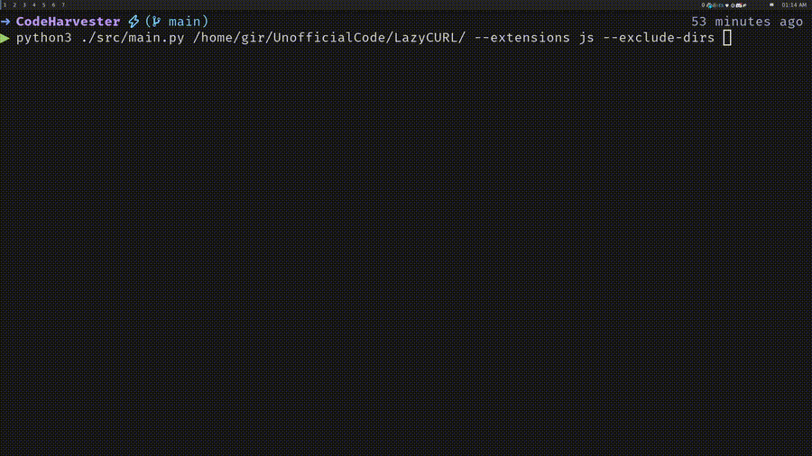

# CodeHarvester

CodeHarvester efficiently aggregates code and text from files for streamlined AI analysis, simplifying data compilation for prompts.



## Clone the Repository

To begin, clone the repository to your local machine:

```bash
git clone https://github.com/EsteveSegura/CodeHarvester.git
cd CodeHarvester
```

## Installation

Install the necessary dependencies to ensure CodeHarvester runs smoothly:

```bash
pip install -r requirements.txt
```

## Usage

### Basic Command Line Usage

To use CodeHarvester from the command line, navigate to the CodeHarvester directory and execute the following command:

```bash
python3 src/main.py <ROOT_DIRECTORY> --extensions <FILE_EXTENSIONS> --exclude-dirs <DIRECTORIES_TO_EXCLUDE> --exclude-files <FILES_TO_EXCLUDE>
```

### Parameters

- `<ROOT_DIRECTORY>`: The starting point for the directory traversal.
- `--extensions`: Specify file extensions to include in the aggregation (e.g., py, js, txt).
- `--exclude-dirs`: List directories you wish to exclude from the traversal.
- `--exclude-files`: Specify individual files to be omitted from the aggregation.
- `--include-files`: Specify individual files to be aggregated (cannot be used with --exclude-dirs, --exclude-files).
- `--output`: Specify output file path and name. If not specified, the output will be printed to the console.
- `--gui`: Launch a server to display the output in a web interface.

### Running in GUI Mode

To run CodeHarvester in GUI mode, add the `--gui` flag to the command:

```bash
python3 src/main.py <ROOT_DIRECTORY> --gui
```

Navigate to `http://localhost:5043` in your web browser to interact with the application.

## Building the Binary

To compile CodeHarvester into a standalone binary for easy distribution, use PyInstaller:

```bash
pyinstaller main.spec
# The binary will be located in the `dist` directory
```

### Installation Guide

#### Windows

1. **Compile the binary:**

    ```bash
    pyinstaller main.spec
    ```

2. **Create a directory to store the binary:**

    Navigate to the `dist` directory and move the `main` directory to a desired location, for example:

    ```cmd
    mkdir "C:\Program Files\CodeHarvester"
    move dist\main "C:\Program Files\CodeHarvester"
    ```

3. **Add the directory to your PATH:**

    - Open the Start Search, type in "env", and select "Edit the system environment variables".
    - In the System Properties window, click on the "Environment Variables" button.
    - In the Environment Variables window, find the "Path" variable in the "System variables" section and select it. Click on the "Edit" button.
    - In the Edit Environment Variable window, click on "New" and add the path to the directory where you moved `main.exe`. For example, `C:\Program Files\CodeHarvester`.
    - Click "OK" to close all the windows.

Now, you can run `codeharvester` from any path in the terminal by simply typing:

```cmd
codeharvester
```

#### Linux

1. **Compile the binary:**

    ```bash
    pyinstaller main.spec
    ```

2. **Create a directory to store the binary:**

    ```bash
    sudo mkdir -p /usr/local/codeharvester
    sudo cp -r ./dist/main/* /usr/local/codeharvester/
    ```

3. **Create a script to run the binary:**

    ```bash
    sudo tee /usr/local/bin/codeharvester <<'EOF'
    #!/bin/bash
    /usr/local/codeharvester/main "$@"
    EOF
    ```

4. **Give execution permissions to the script:**

    ```bash
    sudo chmod +x /usr/local/bin/codeharvester
    ```

Now, you can run `codeharvester` from any path in the terminal by simply typing:

```bash
codeharvester
```

#### macOS

1. **Compile the binary:**

    ```bash
    pyinstaller main.spec
    ```

2. **Create a directory to store the binary:**

    ```bash
    sudo mkdir -p /usr/local/codeharvester
    sudo cp -r ./dist/main/* /usr/local/codeharvester/
    ```

3. **Create a script to run the binary:**

    ```bash
    sudo tee /usr/local/bin/codeharvester <<'EOF'
    #!/bin/bash
    /usr/local/codeharvester/main "$@"
    EOF
    ```

4. **Give execution permissions to the script:**

    ```bash
    sudo chmod +x /usr/local/bin/codeharvester
    ```

Now, you can run `codeharvester` from any path in the terminal by simply typing:

```bash
codeharvester
```

### Uninstallation Guide

#### Windows (Uninstallation)

1. **Remove the directory from your PATH:**

    - Open the Start Search, type in "env", and select "Edit the system environment variables".
    - In the System Properties window, click on the "Environment Variables" button.
    - In the Environment Variables window, find the "Path" variable in the "System variables" section and select it. Click on the "Edit" button.
    - In the Edit Environment Variable window, select the path to the directory where you moved `main.exe` (e.g., `C:\Program Files\CodeHarvester`) and click on "Delete".
    - Click "OK" to close all the windows.

2. **Delete the directory containing `main.exe`:**

    ```cmd
    rmdir /S /Q "C:\Program Files\CodeHarvester"
    ```

#### Linux (Uninstallation)

1. **Remove the binary:**

    ```bash
    sudo rm /usr/local/bin/codeharvester
    ```

2. **Delete the directory containing the binary:**

    ```bash
    sudo rm -r /usr/local/codeharvester
    ```

#### macOS (Uninstallation)

1. **Remove the binary:**

    ```bash
    sudo rm /usr/local/bin/codeharvester
    ```

2. **Delete the directory containing the binary:**

    ```bash
    sudo rm -r /usr/local/codeharvester
    ```

This guide provides detailed steps for compiling, installing, and uninstalling `codeharvester` on Windows, Linux, and macOS. By following these steps, you can ensure that the software is correctly set up and can be easily removed if necessary.

## Output example

Running the command:

```bash
python3 src/main.py /home/root/code/tmp/is-emoji --extensions js yml --exclude-dirs .git
```

The output consists of all files present in the root folder "is-emoji", except for the .git folder and including all files with .js .yml extension.


## Running Tests

To run the end-to-end tests, use:

```bash
python3 test/e2e.py
```

## Alternatives

For quick tasks, you might use terminal commands like `find` and `tree`:

Aggregate files:

```bash
find /path/to/directory -name '*.py' -print0 | xargs -0 cat > combined_files.txt
```

Generate a directory tree:

```bash
tree /path/to/directory
```
