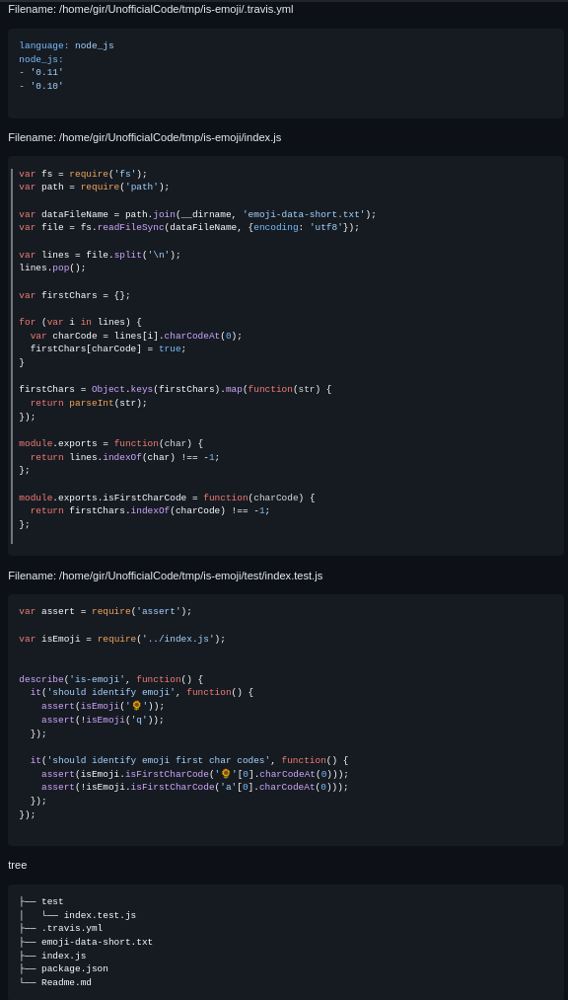

# CodeHarvester

CodeHarvester efficiently aggregates code and text from files for streamlined AI analysis, simplifying data compilation and preparation.

## Clone the Repository

To begin, clone the repository to your local machine:

```bash
git clone https://github.com/EsteveSegura/CodeHarvester.git
cd CodeHarvester
```

## Installation

Install the necessary dependencies to ensure CodeHarvester runs smoothly:

```bash
pip3 install -r requirements.txt
```

## Usage

To use CodeHarvester, navigate to the CodeHarvester directory and execute the following command:

```bash
python3 src/main.py <ROOT_DIRECTORY> --extensions <FILE_EXTENSIONS> --exclude-dirs <DIRECTORIES_TO_EXCLUDE> --exclude-files <FILES_TO_EXCLUDE>
```

### Parameters

- **<ROOT_DIRECTORY>**: The starting point for the directory traversal.
- **--extensions**: Specify file extensions to include in the aggregation (e.g., py, js, txt).
- **--exclude-dirs**: List directories you wish to exclude from the traversal.
- **--exclude-files**: Specify individual files to be omitted from the aggregation.
- **--output**: Specify output file path

## Examples Of Usage

### Basic Usage

To aggregate Python and JavaScript files:

```bash
python3 src/main.py /path/to/your/directory --extensions py js --output ./output.txt
```

### Excluding Directories and Files

To exclude specific directories and files:

```bash
python3 src/main.py /path/to/your/directory --extensions py js --exclude-dirs node_modules .git --exclude-files example.py --output ./output.txt
```

By following these steps, you can efficiently compile and review large sets of files, making CodeHarvester an indispensable tool for data preparation and analysis.

Feel free to adjust the paths, URLs, and any specific details to better match your project's requirements.

## Example Of Output

Running the command: 

```bash
 python3 src/main.py /home/root/code/tmp/is-emoji --extensions js yml --exclude-dirs .git
 ```

 The output consists of all files present in the root folder "is-emoji", except for the .git folder and including all files with .js .yml extension.



## Build the Binary

Compile the application into a binary for easy execution:

```bash
python3 setup.py
pyinstaller --onefile ./src/main.py
# Find the binary in the /dist directory
```

## Test

To run test just type:

```bash
python3 ./test/find_files_test.py
```

## Alternatives

You can run some commands in your terminal, its not a full alternative but it works:

Agreggate files:

```bash
# find <FOLDER_ROO> -name <EXTENSION> -print0 | xargs -0 cat > <FILE OUTPUT>
find /path/to/www -name '*.html' -print0 | xargs -0 cat > combined_prompt.txt
```

Get the tree:

```bash
# tree folder
tree /path/to/www
```